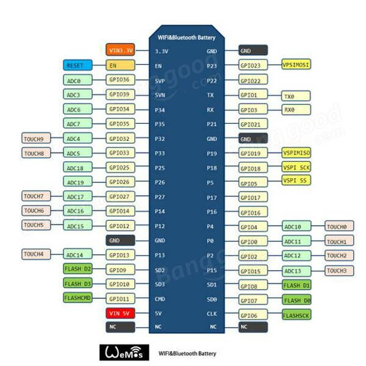
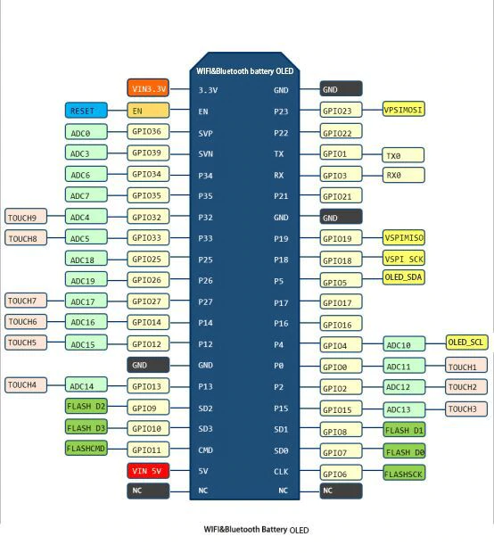

# ImDuino
ImGui on Arduino example

Use the 

# TFT_22_ILI9225 220x176 16bpp TFT

## Requirements

1. The TFT_22_ILI9225 screen and Nkawu's TFT_22_ILI9225 library
2. An Arduino with SPI (this example was designed for an
ESP32-WROOM-32 "WeMos WiFi & Bluetooth Battery")
3. Uncomment `#define IMDUINO_TFT_22_ILI9225` at the top of `ImDuino.ino`



## Setting up hardware

ImDuino is configured by default to use:

* Pin 32 for LED
* Pin 33 for reset
* Pin 27 for RS
* Pin 15 for CS
* Pin 14 for clock
* Pin 13 for SDI

These can be changed by modifying the following constants in `ImDuino.ino`:

```cpp
const uint8_t TFTLED = 32;
const uint8_t TFTRST = 33;
const uint8_t TFTRS  = 27;
const uint8_t TFTCS  = 15;
const uint8_t TFTCLK = 14;
const uint8_t TFTSDI = 13;
```

# SSD1306 128x64 1bpp OLED

## Requirements

1. The SSD1306 screen and Adafruit's SSD1306 library
2. An Arduino with I2C (this example was designed for an
ESP32-WROOM-32 "WiFi & Bluetooth Battery OLED")
3. Uncomment `#define IMDUINO_SSD1306` at the top of `ImDuino.ino`



## Setting up hardware

ImDuino is configured by default to use:

* Pin 4 for SCL (Serial Clock Line)
* Pin 5 for SDA (Serial Data Line)
* No reset pin
* Address 0x3C

These can be changed by modifying the following constants in `ImDuino.ino`:

```cpp
const uint8_t OLEDSDA  = 5;
const uint8_t OLEDSCL  = 4;
const int8_t OLEDRST   = -1;
const uint8_t OLEDADDR = 0x3C;
```
